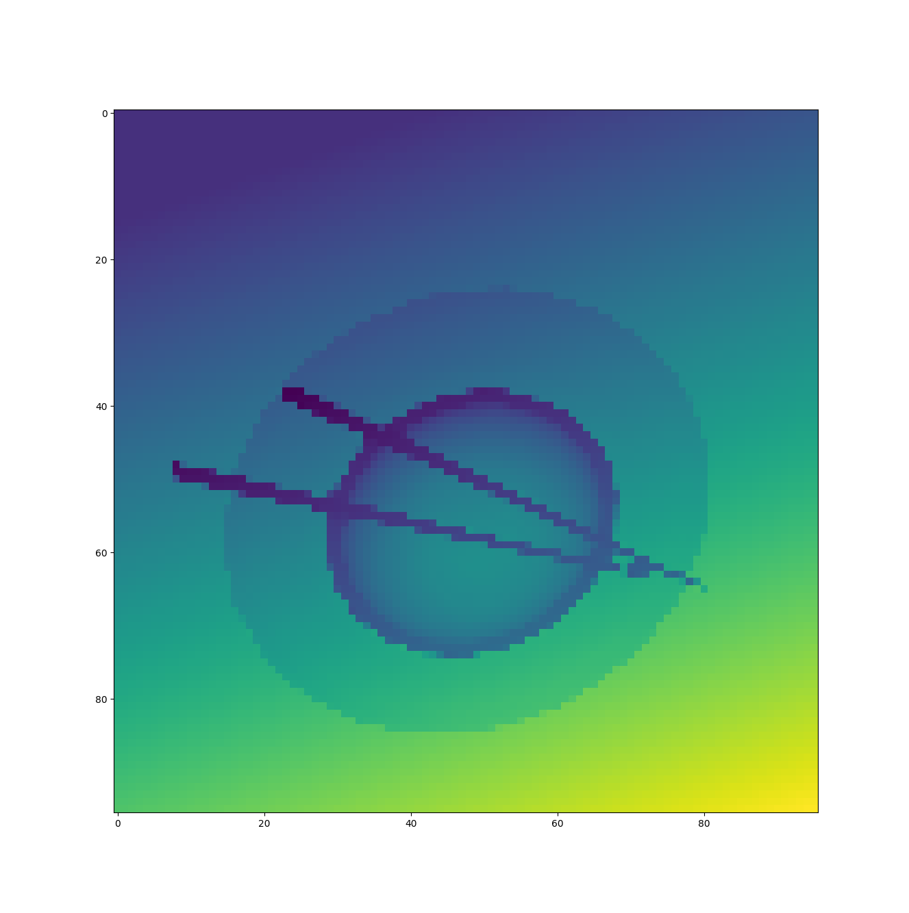
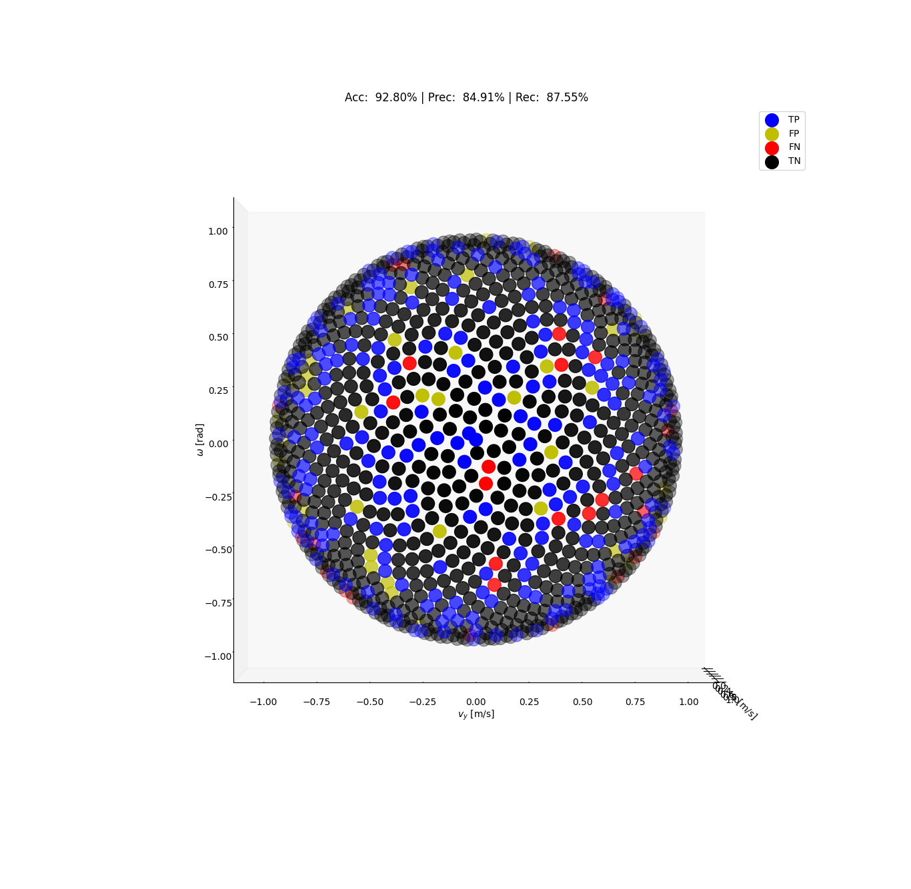
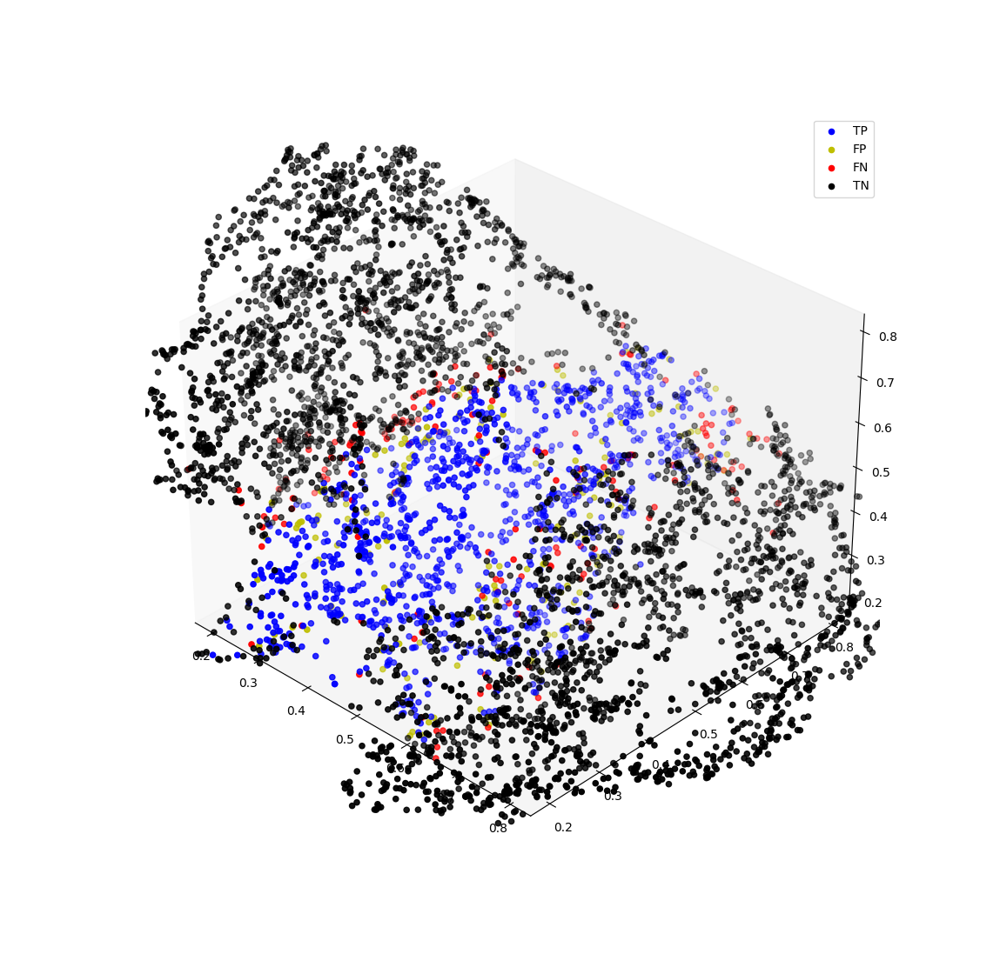
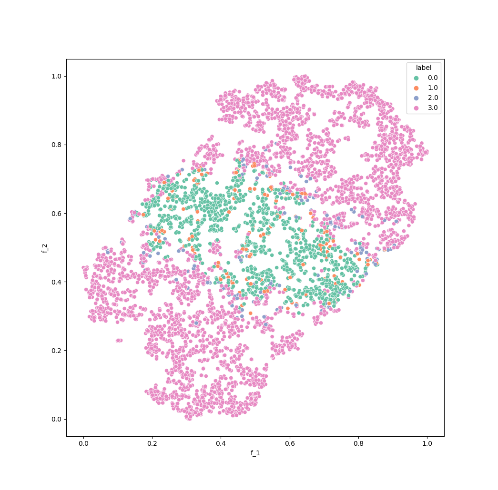
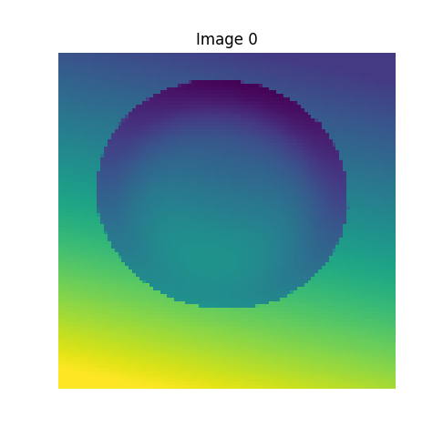
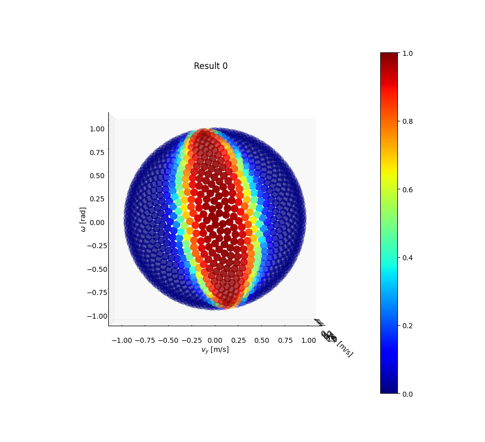
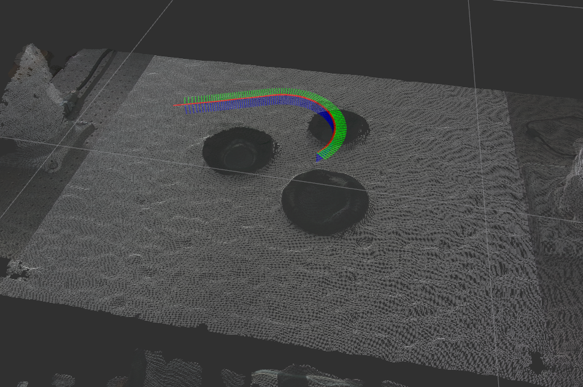

# Stable-PushNet


# 1. Setup
### 1. Install ROS
Tested on ros-noetic versions. [ROS Install](http://wiki.ros.org/noetic/Installation/Ubuntu)
### 2. Workspace
Make catkin workspace
```bash
mkdir -p ~/catkin_ws/src
```
Clone the current git repository
```bash
git clone https://github.com/Hongyoungjin/stable-pushnet-network.git
```

### 3. Dependencies
```bash
pip install -r requirements.txt
```
#### For safety, install Pytorch with the following command

```bash
pip3 install torch torchvision torchaudio
```

# 2. Network Trainer

### 1. Link train dataset to the network trainer
After synthetic data generation in [stable-pushnet-datagen](https://github.com/Hongyoungjin/stable-pushnet-datagen), train dataset folder 'data', including 'data_stats' and 'tensors' folder will be created. \
Set path to 'data' folder in the first line in [config.yaml](/config.yaml).

```
data_path: /path/to/train/dataset/folder/data
```

### 2. Train The model

```bash
cd ~/catkin_ws/src/stable-pushnet-network/scripts
python3 train.py
```
Since train dataset includes both masked depth image and pure depth image, you can choose the type of network input by defining planner - image_type in [config.yaml](/config.yaml) ('masked' or 'pure').


# 2. Model Performance Visualizer
The following tools are for analyzing the performance of trained model. \
We can analyze the classifier model using confusion matrix (accuracy, precision, and recall)

### 1. Confusion Plotting
For a given network input image, plots the confusion output throughout the input velocity half-sphere.\
Each velocity data point corresponds to one of (True Positive, False Positive, True Negative, and False Negative).

```bash
cd ~/catkin_ws/src/stable-pushnet-network/scripts
python3 plot_confusion.py
```

Set configuration in "confusion" directory in [config.yaml](/config.yaml).

|  |  |
|:-----------------------------------------------:|:-----------------------------------------------:|
|                Input Depth Image               |                     Confusion Plot                      |


### 2. Feature Mapping
Visualizes the model's latent space (3D and 2D) through feature dimension reduction.\
Used PCA to reduce 128 dimensions to 50, and t-SNE to 3 and 2.\
Each feature data point corresponds to one of (True Positive, False Positive, True Negative, and False Negative).

```bash
cd ~/catkin_ws/src/stable-pushnet-network/scripts
python3 feature_map.py
```


Set configuration in "feature" directory in [config.yaml](/config.yaml).

|  |  |
|:-----------------------------------------------:|:-----------------------------------------------:|
|                 Feature Plot (3D)                  |              Feature Plot (2D) 2                       |

### 3. Network Output Visualization
For a given network input image, plots the network output (0~1) throughout the input velocity half-sphere.

```bash
cd ~/catkin_ws/src/stable-pushnet-network/scripts
python3 plot_network_output.py
```

Set configuration in "network_output" directory in [config.yaml](/config.yaml).

|   |   |
|:-----------------------------------------------:|:-----------------------------------------------:|
|               Input Depth Image             |                 Network Output                   |
# 3, Push Planner
### Set configuration
In [config.yaml](/config.yaml),

1. To use network-based model, set "planner / learning_base" to True
2. To change the network threshold, change the "network / network_threshold" value.

Detailed description of each configuration element is as follows:
#### 1. planner
The overall configuration of the pushing environment.

- gripper_width: 
  - Width of the parallel-jaw gripper (in meters, default: 0.08)
  - If you want to apply the different width, you have to retrain the network or use the depth-based model.

- num_push_directions: 
  - Number of initial push directions (default: 4)
  
- learning_base: 
  - Whether to use the pre-trained network model (default: True)


- visualize: 
  - Whether to visualize the push contact (default: False)


- height: 
  - Height of the resultant path (in meters, default: 0.015) 
  - Since the height of the path may vary depending on the table height, this value may not affect the actual push path.

#### 2. depth_based
Configuration for the depth-based (analytical & non-trained) model. 
- friction_coefficient: 
  - Friction coefficient between the pusher (robot gripper) and the slider (dish)
  
#### 3. network
Configuration for the network model.
- model_name: 
  - Name of the network model. The model file is stored in [network_data](./network_data/models/).
- network_threshold: 
  - The network threshold to determine whether the given push is considered successful or not.

#### 4. hybrid
Configuration for the Hybrid-A* Algorithm.
- grid_size: Grid size of each node (in meters)
- dtheta: Unit angle difference to make the child nodes (in radians)

### Launch the push-path planning server node
```bash
roslaunch stable_pushnet_ros server.launch
```
# 3. Tutorial
The module returns a push path with push success metric through ROS service.

### Services

- /stable_push_planner/get_stable_push_path ([stable_push_planner/GetStablePushPath](./srv/GetStablePushPath.srv))
- Request push target as a result of push-target module

#### 1. Request
- dish_segmentation ([vision_msgs/Detection2DArray](http://docs.ros.org/en/noetic/api/vision_msgs/html/msg/Detection2DArray.html))
  - Dish segmentation result (KIST vision module output)
- table_detection ([vision_msgs/BoundingBox3D](http://docs.ros.org/en/noetic/api/vision_msgs/html/msg/BoundingBox3D.html))
  - Table detection result (KIST vision module output)
- depth_image ([sensor_msgs/Image](http://docs.ros.org/en/noetic/api/sensor_msgs/html/msg/Image.html))
  - Depth image of the entire scene
- cam_info ([sensor_msgs/CameraInfo](http://docs.ros.org/en/noetic/api/sensor_msgs/html/msg/CameraInfo.html))
  - Camera info of the depth camera
- camera_pose ([geometry_msgs/PoseStamped](http://docs.ros.org/en/noetic/api/geometry_msgs/html/msg/PoseStamped.html))
  - Depth camera pose
- push_targets ([PushTargetArray]([PushTargetArray](./msg/PushTargetArray.msg)))
  - Array of push targets

#### 2. Response

- path [nav_msgs/Path](http://docs.ros.org/en/noetic/api/nav_msgs/html/msg/Path.html)
  - Path of the end-effector (center of the fingertips) to push the target
- plan_successful (`bool`)
  - True if the plan was successful
  - False if the plan failed. In this case, the module reutrns a dummy path.

### Custom Messages
#### 1. PushTargetArray ([PushTargetArray]([PushTargetArray](./msg/PushTargetArray.msg)))
Array of push targets
#### 2. PushTarget [PushTarget]([PushTarget](./msg/PushTarget.msg))
- priority (`int32`)
  - Priority of the target. Smaller, higher priority
- push_target_id (`int32`)
  - ID of the target
- goal_pose ([geometry_msgs/Pose2D](http://docs.ros.org/en/noetic/api/geometry_msgs/html/msg/Pose2D.html))
  - Goal pose of the target object
- start_pose_min_theta ([geometry_msgs/Pose2D](http://docs.ros.org/en/noetic/api/geometry_msgs/html/msg/Pose2D.html))
    - Initial contact pose of the target, with the smallest push direction
- start_pose_max_theta ([geometry_msgs/Pose2D](http://docs.ros.org/en/noetic/api/geometry_msgs/html/msg/Pose2D.html))
    - Initial contact pose of the target, with the largest push direction

### Example
1. Launch the push-path planning server node
```bash
roslaunch stable_pushnet_ros server.launch
```
2. Request the push-path
```bash
rosrun stable_pushnet_ros example.py
```
3. Observe the resultant push-path
- We can see in the rViz visalization.
```bash
roslaunch stable_pushnet_ros example.launch
```
<div align="center">

</div>